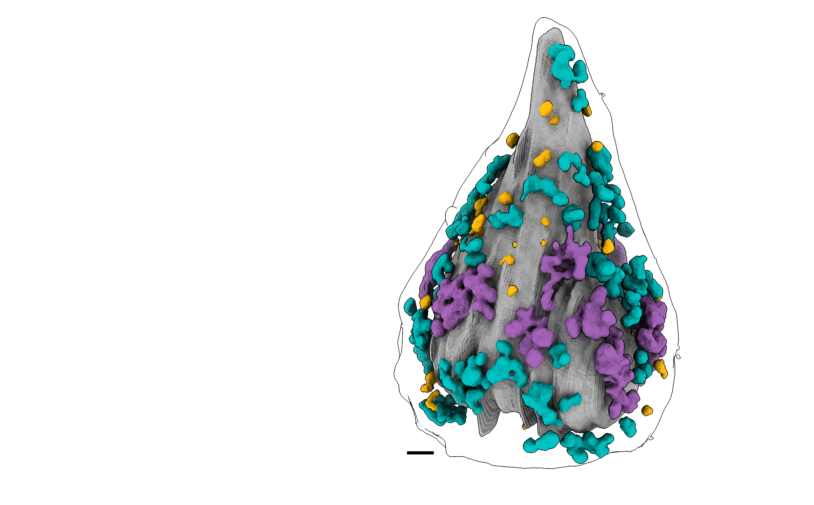
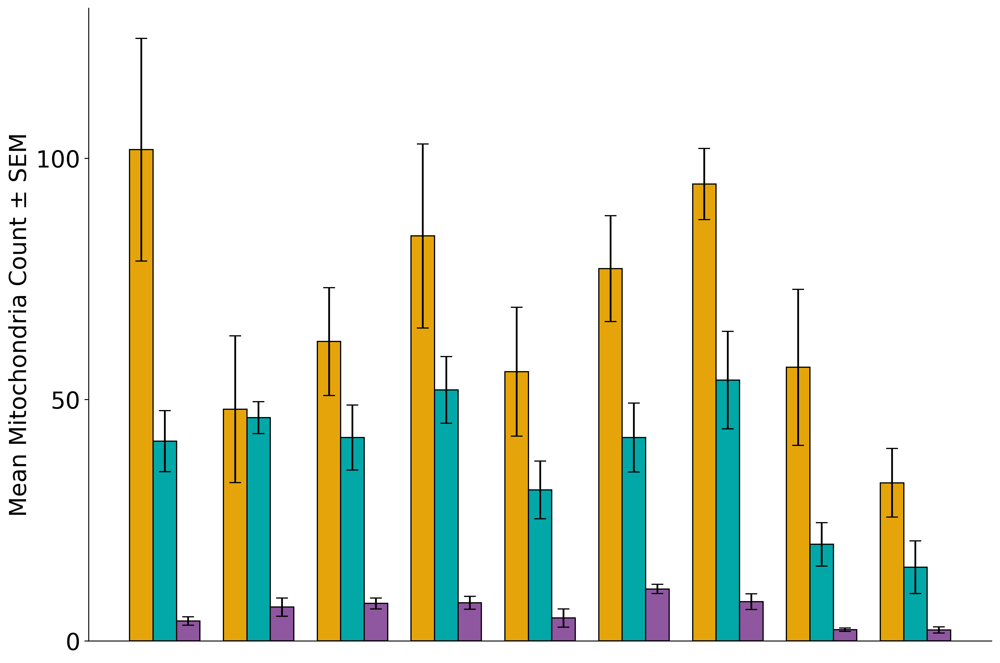

This is the official codebase for the analysis presented in:  
**[Morphotype-Resolved 3D Morphometry Reveals a Structure-Density-Location Coupling in Mitochondrial Networks](https://doi.org/10.64898/2026.03.19.712811)** *(Singh et al., 2026)*.

---

## 🔬 Methods Summary
Our pipeline introduces a morphotype-resolved 3D morphometry approach to quantify mitochondrial networks. By segmenting high-resolution tomograms, we extract distinct spatial and structural features—linking mitochondrial shape (structure), internal characteristics (density), and cellular positioning (location). This multidimensional characterization provides new insights into mitochondrial dynamics and cellular metabolism.

## 🖼️ Example Outputs
This repository generates 3D surface renderings, morphological distributions, and morphotype clustering plots directly from raw tomogram data.

<p align="center">
  
  
</p>

---

## ⚙️ Prerequisites & Environment Setup
We recommend using [Anaconda](https://docs.anaconda.com/anaconda/install/) or Miniconda to manage dependencies.

**1. Create and activate the environment:**
```bash
conda env create -f env/environment.yml
conda activate Mito_Morph_Analysis
```
#### Data Requirements & Naming Convention:
- Tomogram file name should end with `_pre_rec.mrc`.
- Mask file name should end with `_pre_rec_labels.mrc`.
- Tomogram and corresponding label must have **identical shape**, e.g. both tomogram and corresponding label has shape `(425, 430, 410)`. Each independent tomogram can be of different size.
- Inside the `Data` folder, the user must create individual folders for each tomogram, each containing three files: the tomogram, the mask, and the tomogram-specific JSON file. A sample JSON file is provided in `Data/783_6_pre_rec`.
- Include a `parameter.json` file inside the Data folder. Example file `parameter.json` is provided in the `Data` folder.
- Label encoding must follow:
  - `0` → background
  - `1` → cytoplasm label
  - `2` → nucleus
  - `5` → mitochondria
## Analysis
To run the paper experiments and generate plots, user should clone this repo and install the given environment. Then run the Jupyter notebook `MitoMorph_Analysis.ipynb` on dataset.

#### If you use this code or our dataset in your research, please cite our paper:
@article{singh2026mitomorph, title={Morphotype-Resolved 3D Morphometry Reveals a Structure-Density-Location Coupling in Mitochondrial Networks},
  author={Singh, A. and Yadav, A. and Deshmukh, A. and Varma, R. and Singh, A. and White, K. and Singla, J.},
  journal={Journal Name / Pre-print Server},
  year={2026},
  doi={10.64898/2026.03.19.712811},
  url= https://doi.org/10.64898/2026.03.19.712811
  }


