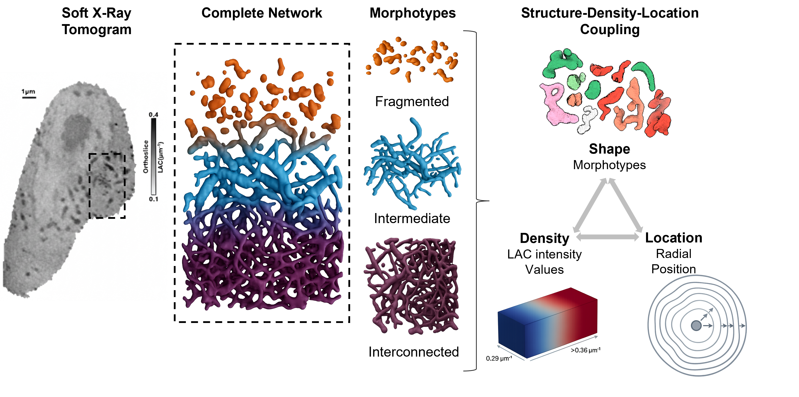

<p align="center">
  
</p>

<h1 align="center">Mitochondrial Morphotype Characterization</h1>

This is the codebase used for the analysis in paper. [Singh, A., Yadav, A., Deshmukh, A., Varma, R., Singh, A., White, K., & Singla, J. (2026). Morphotype-Resolved 3D Morphometry Reveals a Structure-Density-Location Coupling in Mitochondrial Networks](https://doi.org/10.64898/2026.03.19.712811)

## Prerequisties / Environment Setup
Install Anaconda for setup ([link](https://docs.anaconda.com/anaconda/install/))

#### Create environment (recommended):
```
conda env create -f env/environment.yml
conda activate sxt_seg
```
#### Data Requirements & Naming Convention:
- Tomogram file name should end with `_pre_rec.mrc`.
- Mask file name should end with `_pre_rec_labels.mrc`.
- Tomogram and corresponding label must have **identical shape**, e.g. both tomogram and corresponding label has shape `(425, 430, 410)`. Each independent tomogram can be of different size.
- Inside `Data` folder, user have to make individal folders for each tomogram like `Data/Cell1/` `Data/Cell2/`
- To prepare the data for Analysis, copy individual Raw mrc Cell, Mask and corresponding json file inside each `Data/` subfolders.
- Label encoding must follow:
  - `0` → background
  - `1` → cytoplasm label
  - `2` → nucleus
  - `5` → mitochondria
## Analysis
To run the paper experiments and generate plots user should clone this repo, install the given environment and then run the Jupyter notebook `MitoMorph_Analysis.ipynb`
